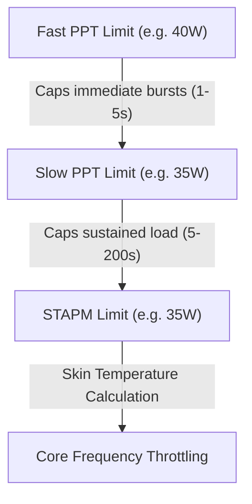

# 🧠 Hardware Architecture, Theory of Operation & Power State Engineering

This document details the reverse engineering, firmware mechanics, silicon architecture, and electrical theory behind the **Huawei MateBook D (HN-WX9X / AMD Ryzen 5 3500U Picasso)** battery emulation and high-performance power tuning.

---

## Table of Contents
1. [Silicon Architecture: AMD Precision Boost 2 on Zen+ Picasso](#1-silicon-architecture-amd-precision-boost-2-on-zen-picasso)
   - Single-Core Turbo (3.7 GHz) vs. All-Core Physical Limits (~3.05 GHz)
   - The Fused Multiplier Table (FIT)
2. [The Infamous 400 MHz Throttling Phenomenon](#2-the-infamous-400-mhz-throttling-phenomenon)
   - Hardware BD PROCHOT Assertion
   - 65W USB-PD Charger Transient Sag & Brownout Prevention
   - The "PROCHOT Deassertion Ramp" Recovery Trap
   - Why OS Governors Cannot Overrule 400 MHz
3. [Embedded Controller (EC) & ACPI DSDT Disassembly](#3-embedded-controller-ec--acpi-dsdt-disassembly)
   - The Strict `_BIX` Evaluation Condition
   - Memory Map of the Battery Interface
   - Why Earlier Emulators Broke System Telemetry
4. [Ryzen SMU Power Limiting Architecture](#4-ryzen-smu-power-limiting-architecture)
   - STAPM (Skin Temperature Aware Power Management)
   - PPT (Package Power Tracking): Fast vs. Slow
   - The VRM Electrical Current Ceiling: TDC and EDC
5. [The Engineered Solution & Stability Strategy](#5-the-engineered-solution--stability-strategy)
   - Why 85°C Tctl Was Chosen as the Optimal Ceiling
   - Neutralizing the 400 MHz Lock with Ramp=1
   - Cyclic Overrides via Daemon Architecture

---

## 1. Silicon Architecture: AMD Precision Boost 2 on Zen+ Picasso

The AMD Ryzen 5 3500U is manufactured on GlobalFoundries' 12nm FinFET node using the **Zen+ (Picasso)** microarchitecture. It integrates 4 physical cores (8 threads via SMT) and an 8-Compute Unit Radeon Vega GPU.

### A. Single-Core Turbo vs. All-Core Limits
Official marketing lists the processor at:
* **Base Clock:** `2.10 GHz`
* **Max Boost Clock:** `up to 3.70 GHz`

On mobile APUs, the advertised turbo frequency (**3.7 GHz**) is strictly a **1-Core burst limit**. AMD’s Precision Boost 2 (PB2) algorithm continuously samples telemetry (temperature, current, package power, active thread count) and references a hardcoded **Fused Information Table (FIT)** stored in the processor’s System Management Unit (SMU) ROM.

### B. The Fused Core-Count Multiplier Curve
Because the Ryzen 5 3500U has locked multipliers (`Multiplier Unlocked: No`), the SMU enforces strict upper ceilings depending on active physical core count:

| Active Core Count | Maximum Multiplier | Ceiling Frequency | Description |
| :--- | :---: | :---: | :--- |
| **1 Core Active** | `37.0x` | **3.70 GHz** | Burst single-threaded execution |
| **2 Cores Active** | `34.5x` | **3.45 GHz** | Dual-core compute loads |
| **3 Cores Active** | `32.0x` | **3.20 GHz** | Tri-core loads |
| **4 Cores (8 Threads)** | `30.0x – 30.5x` | **~3.00 – 3.05 GHz** | **Physical All-Core Limit of 12nm Picasso** |

Under full 8-thread AVX workload (such as PrimeGrid/BOINC `sr5sieve`) alongside 100% Vega 8 GPU compute, **~3.05 GHz is the absolute mathematical and physical ceiling of this silicon**. An upgraded cooling solution cannot bypass this multiplier limit, but it *will* ensure the CPU holds 3.05 GHz permanently without dipping.

---

## 2. The Infamous 400 MHz Throttling Phenomenon

A common issue observed by laptop power users is the processor abruptly locking to **400 MHz (0.4 GHz)** and refusing to clock back up, resulting in severe system sluggishness.

### A. The Minimum OS Frequency vs. 400 MHz
In the Linux kernel, the CPU scaling driver (`acpi-cpufreq`) exposes the following ACPI P-states:
* `P0`: 2100 MHz
* `P1`: 1700 MHz
* `P2`: 1400 MHz (`scaling_min_freq`)

The operating system governor (`schedutil`, `performance`, or `powersave`) **cannot** request a frequency below 1.4 GHz. Therefore, a drop to 400 MHz is not caused by Linux software or power governors. It is a **direct hardware-level emergency intervention**.

### B. Hardware BD PROCHOT (Bi-Directional Processor Hot)
The CPU package has a dedicated physical pin: `PROCHOT#`.
* **Uni-directional PROCHOT:** The CPU drives this pin low to signal to external fan controllers that the silicon is overheating.
* **Bi-directional PROCHOT (BD PROCHOT):** External motherboard circuitry (Embedded Controller, power ICs, charger sense resistors) can pull this line low to force the CPU into emergency limp mode (400 MHz / 4x multiplier).

On the Huawei MateBook D, BD PROCHOT is asserted by the Embedded Controller under three conditions:
1. **VRM Over-Temperature:** The power delivery MOSFETs do not have active fan cooling; they rely on heat spreading across the chassis. At 45W package draw, VRM temperatures can trigger an EC alert.
2. **Charger Transient Voltage Sag:** The factory Huawei charger provides **65W USB-PD** (20V @ 3.25A). Under full combined load (APU @ 45W + display panel @ 5W + RAM/NVMe/fans @ 7W = ~57W), any minor wall outlet fluctuation or transient spike trips the power controller’s brownout protection, pulling BD PROCHOT.
3. **Battery Communication Drop:** If the EC polls the battery over SMBus and encounters an I2C NACK or missing response packet, it engages battery failsafe throttling.

### C. The "PROCHOT Deassertion Ramp" Trap
The primary reason laptops *stay* stuck at 400 MHz is the SMU's recovery mechanism. By default, when `PROCHOT#` is deasserted (even if the spike only lasted 5 ms), the SMU initiates a slow recovery ramp that can lock the CPU at 400 MHz for 30 to 60 seconds.

**Our Fix:** By issuing the SMU service call `--prochot-deassertion-ramp=1` via `ryzenadj`, we configure the recovery ramp time to the minimum possible interval (1 ms). If a micro-spike occurs, the CPU instantly snaps back to 3.0 GHz without stalling the system.

---

## 3. Embedded Controller (EC) & ACPI DSDT Disassembly

Disassembly of the laptop's DSDT table (`/sys/firmware/acpi/tables/DSDT`) revealed the exact structure of Huawei's battery interface.

### A. The Strict `_BIX` Evaluation Condition
The ACPI method `_BIX` (Battery Information Extended) is called by the operating system kernel to discover battery design characteristics. Disassembled ASL code:

```asl
Method (_BIX, 0, Serialized)
{
    If (ECOK ())
    {
        If ((Acquire (Z009, 0x2000) == Zero))
        {
            // CRITICAL CHECK: ALL THREE MUST BE NON-ZERO
            If (((BTDV && BTFC) && BTDC))
            {
                BPKG [One] = One
                Local0 = BTDC /* Design Capacity */
                BPKG [0x02] = Local0
                Local0 = BTFC /* Last Full Charge Capacity */
                BPKG [0x03] = Local0
                BPKG [0x05] = BTDV /* Design Voltage */
                ...
                BPKG [0x08] = BTCC /* Cycle Count */
            }
            Release (Z009)
        }
    }
    Return (BPKG)
}
```

### B. Memory Field Layout in EC RAM
Tracing the symbols back to the `EmbeddedControl` OperationRegion in `EC0`:

```text
Byte Offset   Field   Bit Width   Description
─────────────────────────────────────────────────────────────────────────────
0x80          ACST    1 bit       Bit 0: AC Power Supply Status (1 = Online)
0x80          BST1    1 bit       Bit 1: Battery 1 Present Flag (1 = Present)
0x84          BTDC    16-bit      Battery Design Capacity (in mAh)
0x86          BTDV    16-bit      Battery Design Voltage (in mV)
0x88          BTFC    16-bit      Battery Full Charge Capacity (in mAh)
0x90          BAPV    16-bit      Battery Present Voltage (in mV)
0x92          BARC    16-bit      Battery Remaining Capacity (in mAh)
0x94          BFCC    16-bit      Battery Current Full Capacity (in mAh)
0x9A          BTEM    16-bit      Battery Temperature (in tenths of Kelvin)
```

### C. Why Earlier Patchers Failed
Previous attempts only wrote to `0x90` (Voltage) and `0x88` (Full Charge). They left `0x84` (`BTDC`) and `0x86` (`BTDV`) at `0x00`. 
Because `BTDV && BTDC` evaluated to `False`, the `_BIX` block aborted. The Linux kernel never populated `energy_full` or `capacity` in sysfs, causing BTOP and battery applets to report that no battery was detected.

By injecting valid values across **all offsets simultaneously**, the OS registers a healthy, active battery and enables normal ACPI power policies.

---

## 4. Ryzen SMU Power Limiting Architecture

The AMD SMU regulates power draw using three nested tiers:



1. **Fast PPT (Package Power Tracking):**
   * The instantaneous maximum power the APU package can draw during transient spikes (typically sustained for 1–5 seconds).
2. **Slow PPT:**
   * The sustained package power allowed over a rolling average of ~5 to 10 seconds.
3. **STAPM (Skin Temperature Aware Power Management):**
   * A mathematical model that estimates chassis skin temperature based on sustained wattage over a 200-second window. In factory firmware, Huawei limits this to **18.0 Watts**. Once reached, the APU is severely choked back to 18W, capping all cores to ~2.1 GHz.

### The VRM Current Bottlenecks (TDC & EDC)
Even if Fast PPT is set to 45W, the CPU can remain throttled if it hits electrical current limits:
* **TDC (Thermal Design Current):** Sustained current delivery limit of the motherboard VRM stages (default: 35 Amps).
* **EDC (Electrical Design Current):** Peak instantaneous current limit of the VRM stages (default: 45 Amps).

Under heavy multi-core load, our telemetry revealed `EDC VALUE VDD` hitting **42.5A to 44.9A**, immediately bumping against the 45A factory limit. By raising EDC to **65A** and TDC to **50A**, the electrical bottleneck was removed, allowing the cores to draw the wattage needed to reach 3.0+ GHz.

---

## 5. The Engineered Solution & Stability Strategy

### A. Why 85°C Tctl Was Chosen as the Optimal Ceiling
* AMD lists maximum silicon operating temperature (**Tjmax**) as **105°C**.
* Setting `--tctl-temp=85` provides a **20°C safety buffer** below Tjmax.
* At 85°C, thermal paste breakdown is minimized, fan bearing stress is reduced, and the motherboard VRMs remain well within their safe thermal envelope.

### B. Parameter Summary of the Optimized Daemon
Our background service executes the following SMU configuration loop every 3 seconds:

| Parameter | Value | Engineering Rationale |
| :--- | :---: | :--- |
| `--stapm-limit` | `35000 mW` (35W) | Eliminates the restrictive 18W factory ceiling |
| `--fast-limit` | `40000 mW` (40W) | Allows burst power for high-priority threads |
| `--slow-limit` | `35000 mW` (35W) | Sustained power budget for 24/7 compute |
| `--vrm-current` (TDC) | `50000 mA` (50A) | Prevents sustained current clamping |
| `--vrmmax-current` (EDC) | `65000 mA` (65A) | Unlocks core electrical headroom |
| `--tctl-temp` | `85 °C` | Prevents VRM heat saturation and BD PROCHOT trips |
| `--prochot-deassertion-ramp` | `1` | Forces instantaneous recovery if a transient spike occurs |
| `/dev/cpu_dma_latency` | `0` | Locks CPU C-states to prevent sleep transitions |
